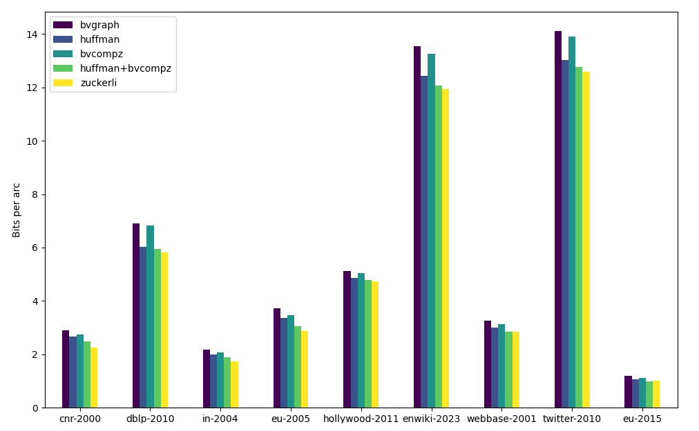
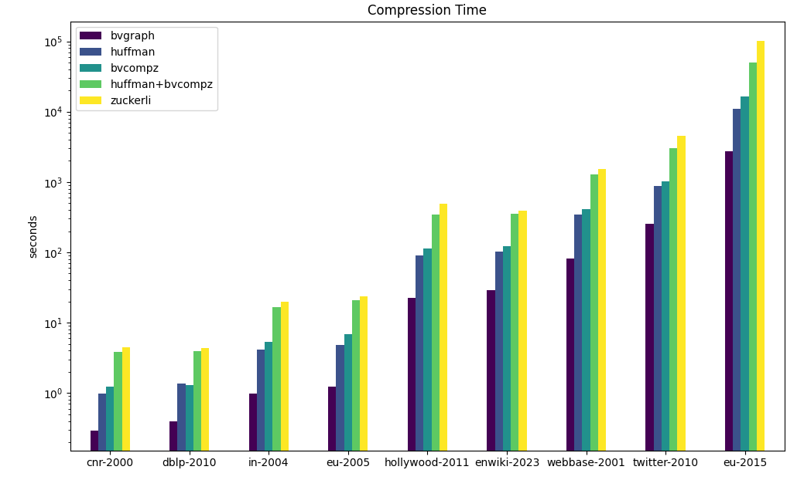
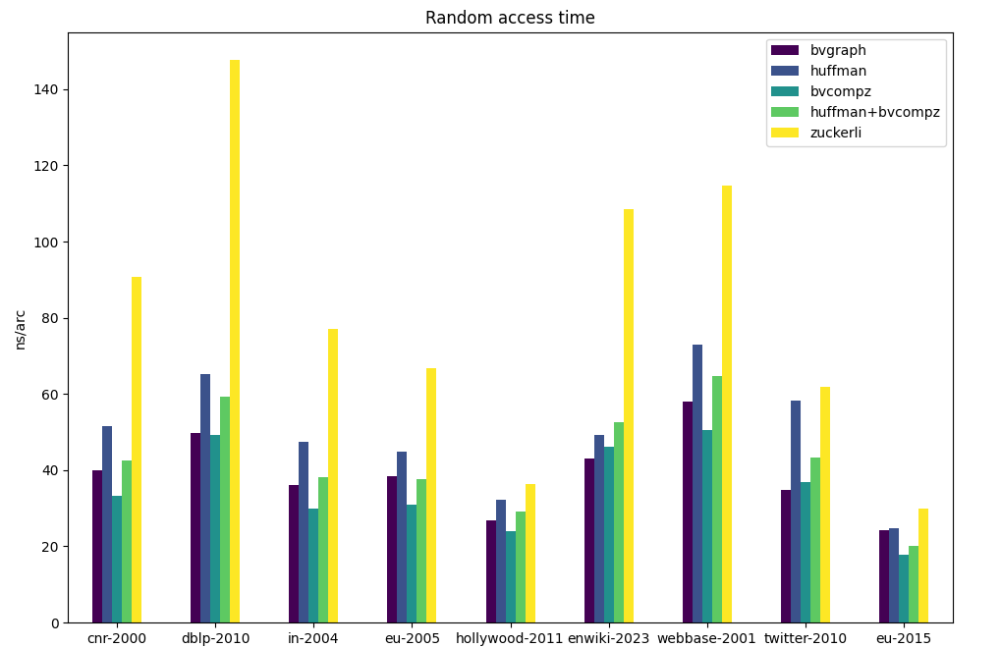

This repository provides a Rust implementation of a Huffman encoder for integers using the Hybrid Integer Encoding technique described in Zuckerli_[1]_ integrating it in the Rust framework of Webgraph_[2, 3]_.

Unlike the proposed Huffman encoder, this implementation has no limit on word size, allowing for more flexible and efficient encoding schemes.

In addition to the encoder, this project uses a fork of [webgraph-rs](https://github.com/colobrodo/webgraph-rs/tree/bvgraphz), where a chunked version of the approximate reference selection algorithm proposed by Zuckerli is implemented. This allows for more efficient reference selection during compression.

## Graph Conversion Tools
A set of commands is provided to benchmark the current implementation and convert graphs from WebGraph to the new Huffman-based representations.

## Experimental Results
The following compressors are evaluated experimentally over a set of 10 graphs from the [LAW website](https://law.di.unimi.it/datasets.php) and from the [Software Heritage](https://docs.softwareheritage.org/devel/swh-export/graph/dataset.html) project. 
- **webgraph:** The baseline implementation of [webgraph](https://github.com/vigna/webgraph-rs).
- **zuckerli:** the original [Zuckerli](https://github.com/google/zuckerli) implementation with the default parameters.
- **huffman:** A version with greedy reference selection and Huffman coding.
- **bvcompz:** A version with instantaneous codes and the new reference selection algorithm.
- **huffman+bvcompz:** A version with the new reference selection algorithm and Huffman-based codes.

### Compression Ratio

The Huffman-based hybrid encoding achieves a compression ratio that is 10–17% better than the standard WebGraph implementation, though it does not reach the compression levels of Zuckerli. However, it offers a good trade-off between compression and decoding speed.

### Compression Time

### Random Access Decoding Time

One of the main advantages of this implementation is the significantly faster random access decoding time compared to the default Zuckerli implementation, thanks to a reduced context model.

## References

_[1] Luca Versari, Iulia-Maria Comsa, Alessio Conte, Roberto Grossi: Zuckerli: A New Compressed Representation for Graphs. IEEE Access 8: 219233-219243 (2020)._   

_[2] Paolo Boldi and Sebastiano Vigna. "The WebGraph Framework I: Compression Techniques." In: Thirteenth International World Wide Web Conference Proceedings, WWW2004 (Apr. 2004). doi: 10.1145/988672.988752._   

_[3] Tommaso Fontana, Sebastiano Vigna, and Stefano Zacchiroli. “WebGraph: The Next Generation (Is in Rust)”. In: Companion Proceedings of the ACM on Web Conference 2024 (2024), pp. 686–689. doi: 10.1145/3589335.3651581._
